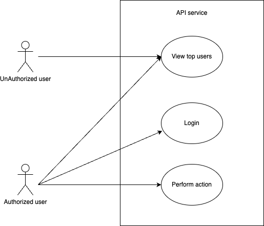
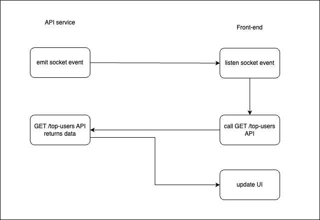
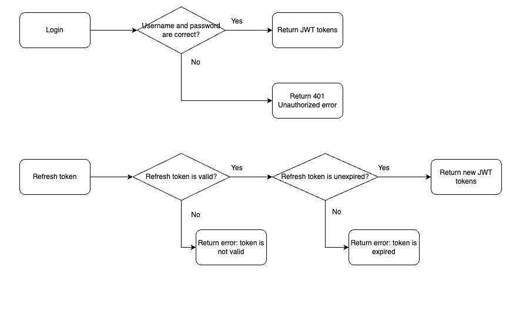
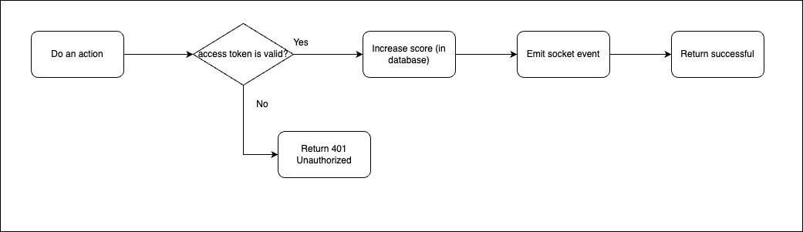
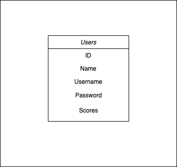

# Software Specification

## 1. Introduction

### 1.1. Purpose

This is the software specification document for a back-end module for score board feature in a website.

### 1.2. Intended Audience

This document can be used by developers, project managers and testers.

### 1.3. Intended Use

To understand the flow and requirements of the software, intended audience can use this document in development and quality assurance process.

### 1.4. Product Scope

For users who are members in website and who want to view top scores.

## 2. Overall Description

### 2.1. Object

| No. | Object             | Action                                                  |
|-----|--------------------|---------------------------------------------------------|
| 1   | Unauthorized users | View top users                                          |
| 2   | Authorized users   | View top users, login, perform action to increase score |

- Unauthorized users are person who visit the wesbite as a guest, they do not have information to login on website.
- Authorized users are members in website who have information to login.

## 3. System Features and Requirements

### 3.1. Functional Requirements

#### 3.1.1. View the top 10 user’s scores

We need an API GET /top-scores which:
- returns data of top 10 users, sort by score.
- an open API, do not required to login.

#### 3.1.2. The score board will be live updated

We use a socket to handle this feature. In NodeJS, we use SocketIO. The socket emits an event when user's scores are updated.

Front-end side listens socket event and then call API to get new top 10 list.

#### 3.1.3. User can login

APIs needed:
- POST /login API accepts data of username and password, then returns JWT tokens including access token and refresh token if login successfully, otherwise returns 401 error.
- POST /refresh-token API returns new access token.

#### 3.1.4. User can perform an action
Authorized user can perform an action on website, then that user's score will be increased.

API needs POST /do-action API:
- This API is protected, we need provide valid access token to perform it.
- Increases user's score.
- Emit an event on socket, this event means user's scores were updated.
- Return 200 code when successfully, return 401 error if access token is invalid.

### 3.2. Nonfunctional Requirements

- Website runs on the most popular latest web browsers like: Google Chrome, Safari.

## 4. Database design

## 5. Reference development packages

- API service written in ExpressJS: https://expressjs.com/
- Socket used is SocketIO: https://socket.io/
- RESTFul API's principle: https://en.wikipedia.org/wiki/REST
- JWT: https://jwt.io/introduction
